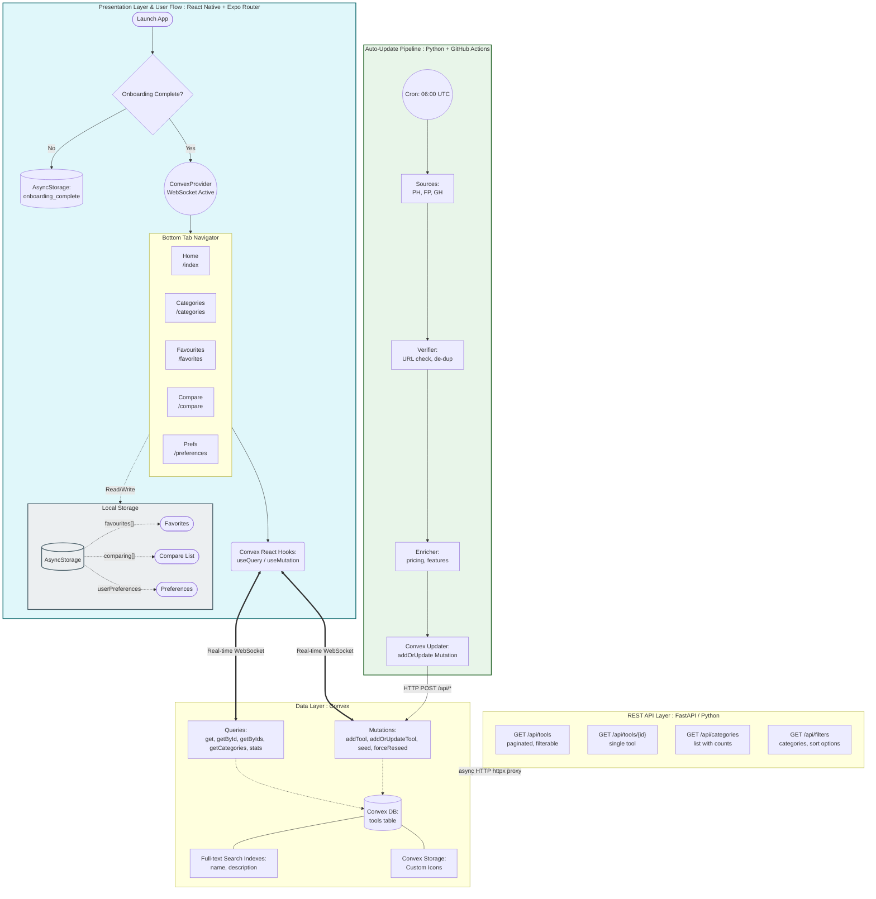

<div align="center">


# 🤖 Pookies AI Zone

### *The Ultimate AI Tools Directory — Curated, Compared & Always Up-to-Date*

[](https://reactnative.dev)
[](https://expo.dev)
[](https://www.typescriptlang.org)
[](https://www.python.org)
[](https://convex.dev)
[](https://fastapi.tiangolo.com)
[](/.github/workflows/)

**Browse 320+ AI tools. Compare side-by-side. Discover what fits your workflow.**

[Features](#-features) · [Architecture](#-architecture) · [Tech Stack](#-tech-stack) · [Screens](#-screens--navigation) · [Getting Started](#-getting-started) · [Data Pipeline](#-data-pipeline) · [Project Health](#-project-health)

<br/>


</div>

---

## 📖 High-Level Description

**Pookies AI Zone** is a cross-platform mobile application (iOS · Android · Web) that serves as a comprehensive, always-current directory of AI-powered tools. It is purpose-built for developers, designers, and tech enthusiasts who need to evaluate, compare, and choose the right AI tools for their workflow.

The app combines:

- A **real-time, serverless database** (Convex) holding rich metadata for 320+ tools across 40+ categories
- A **Python-powered auto-update pipeline** that fetches new tools daily from ProductHunt, Futurepedia, and GitHub
- A **React Native / Expo** mobile frontend featuring a signature **Clay / Neumorphic** design system with smooth animations
- A **FastAPI proxy backend** that bridges REST clients and the Convex real-time layer
- A **personalised scoring engine** that matches tools to user preferences (price sensitivity, ease-of-use, feature richness, platform requirements)

---

## ✨ Features

| Feature | Description |
|---|---|
| 🔍 **Global Search** | Full-text search across 320+ tool names and descriptions via a Convex search index |
| 🗂️ **40+ Categories** | Browse tools by curated categories (Editors & IDEs, LLMs, Image Gen, Marketing, etc.) |
| ⭐ **Featured Shelf** | Horizontally scrolling featured carousel on the home screen |
| ❤️ **Favourites** | Persist saved tools locally with `AsyncStorage` — works fully offline |
| ⚖️ **Side-by-Side Compare** | Compare up to 4 tools on pricing, platforms, features, and difficulty |
| 🎯 **Preference Engine** | Sliders & toggles for price sensitivity, ease-of-use, feature richness, must-haves |
| 🤝 **Recommendations** | Algorithm calculates match scores against user preferences |
| 📋 **Tool Detail Sheet** | Bottom sheet with full metadata: pros/cons, pricing, platform support, related tools |
| 🔗 **Deep Linking** | Navigate directly to any tool via URL (e.g. `/?toolId=<id>`) |
| 🌊 **Skeleton Loading** | Shimmer skeletons during data fetches for a polished loading experience |
| 🚀 **Onboarding Flow** | First-launch walkthrough stored in `AsyncStorage` |
| 🔄 **Daily Auto-Update** | GitHub Actions pipeline refreshes the tools database every day at 06:00 UTC |
| 📦 **Android APK** | Pre-built debug & release APKs included for direct install |

---

## 🏛️ Architecture

### Architecture Diagram



### Component Tree

```
App (_layout.tsx)
├── OnboardingScreen           [first launch only]
└── ConvexProvider
    └── Tabs (ClayTabBar)
        ├── HomeScreen (/)
        │   ├── GlobalSearch (Modal)
        │   ├── CategoryFilterTabs (horizontal FlatList)
        │   ├── FeaturedShelf (horizontal FlatList)
        │   ├── ToolGridCard × N (2-column FlatList)
        │   │   └── ToolIcon
        │   ├── ComparisonBar (floating action)
        │   └── ToolDetailSheet (bottom sheet)
        │       ├── ToolIcon
        │       ├── ToolReviews
        │       └── RelatedTools
        ├── CategoriesScreen (/categories)
        │   └── CategoryCard × N
        ├── FavouritesScreen (/favorites)
        │   └── ToolListCard × N
        ├── CompareScreen (/compare)
        │   ├── CompareFilter
        │   ├── CompareHeader
        │   ├── CompareRow × N
        │   └── ComparisonMatrix
        ├── [Tool Detail] (/tool/[id])    [hidden tab]
        └── [Preferences] (/preferences)  [hidden tab]
            ├── ClaySlider (price, ease, feature)
            ├── RequirementToggles
            └── UseCaseChips
```

---

## 🗂️ Repository Structure

```
pookies-ai-zone/
│
├── 📱 frontend/                    # React Native / Expo application
│   ├── app/                        # Expo Router file-based routing
│   │   ├── _layout.tsx             # Root layout: Convex, tabs, onboarding
│   │   ├── index.tsx               # Home screen (search, browse, featured)
│   │   ├── categories.tsx          # Category browser
│   │   ├── favorites.tsx           # Saved tools
│   │   ├── compare.tsx             # Tool comparison matrix
│   │   ├── preferences.tsx         # User preference settings
│   │   ├── tool/[id].tsx           # Individual tool detail page
│   │   └── category/[id].tsx       # Category drill-down
│   │
│   ├── components/
│   │   ├── compare/                # Comparison UI components
│   │   ├── navigation/             # Custom Clay tab bar
│   │   ├── onboarding/             # First-launch flow
│   │   ├── recommendations/        # Recommendation cards
│   │   ├── tool/                   # Tool detail sheet, reviews, related
│   │   └── ui/                     # Reusable design-system primitives
│   │       ├── clay-button|card|chip|input|search-bar
│   │       ├── animated-list-item|animated-press
│   │       ├── shimmer (skeleton loading base)
│   │       ├── tool-grid-card|tool-list-card (+skeletons)
│   │       ├── tool-icon
│   │       ├── global-search
│   │       ├── comparison-bar
│   │       └── empty-state
│   │
│   ├── convex/                     # Convex serverless functions & schema
│   │   ├── schema.ts               # Database schema definition
│   │   ├── tools.ts                # Queries & mutations (CRUD + search)
│   │   ├── iconUpdates.ts
│   │   ├── iconFixes.ts
│   │   └── files.ts
│   │
│   ├── data/seedData.ts            # 320+ tools seed dataset
│   ├── hooks/useApi.ts             # Custom REST API hook
│   ├── services/api.ts             # ApiService class (REST → FastAPI)
│   ├── theme/clay.ts               # Clay design tokens, spacing, typography
│   ├── types/index.ts              # Shared TypeScript interfaces
│   └── utils/
│       ├── comparison.ts           # Scoring algorithms (price, ease, features)
│       ├── preferences.ts          # AsyncStorage preference helpers
│       └── search.ts               # Client-side search helpers
│
├── 🐍 backend/                     # Python services
│   ├── server.py                   # FastAPI REST proxy server
│   ├── requirements.txt            # Python dependencies
│   └── auto_update/                # Daily AI tool discovery pipeline
│       ├── main.py                 # Orchestrator (AutoUpdateSystem)
│       ├── sources.py              # SourceConnector ABC + SourceFactory
│       ├── scheduler.py            # Cron scheduler
│       ├── verifier.py             # URL verification + deduplication
│       ├── enrichment_engine.py    # Tool metadata enrichment
│       ├── database.py             # Convex write helpers
│       ├── alerts.py               # Alert manager + audit logger
│       ├── run_daily.py            # CLI entry point (GitHub Actions)
│       └── connectors/
│           ├── futurepedia.py      # Futurepedia connector
│           └── producthunt.py      # ProductHunt GraphQL connector
│
├── 📊 data/                        # Raw data snapshots (JSON)
├── 🎨 design_guidelines.json       # Design system spec & tool catalogue
├── 🔧 tools-data.json              # Latest tools snapshot (auto-updated)
└── .github/workflows/              # GitHub Actions CI/CD
```

---

## ⚙️ Tech Stack

### Frontend

| Technology | Version | Role |
|---|---|---|
| **React Native** | 0.81.5 | Cross-platform mobile framework |
| **React** | 19.1.0 | UI component library |
| **Expo** | 54 | Managed workflow, build tools, native modules |
| **Expo Router** | 6.x | File-based routing (tabs, deep linking) |
| **TypeScript** | 5.x | Static typing throughout the frontend |
| **Convex** | 1.15 | Real-time serverless database + functions |
| **React Native Reanimated** | 4.1 | Declarative animations (spring, interpolation) |
| **React Native Gesture Handler** | 2.28 | Touch gesture recognition |
| **Expo Image** | 3.x | Optimised image loading with caching |
| **Expo Linear Gradient** | 15 | Gradient backgrounds |
| **AsyncStorage** | 2.x | Local persistence (favorites, preferences) |
| **React Navigation (Bottom Tabs)** | 7.x | Tab navigation backing |
| **@expo/vector-icons (FontAwesome)** | 15 | Iconography |
| **class-variance-authority** | 0.7 | Variant-driven component styling |

### Backend

| Technology | Version | Role |
|---|---|---|
| **Python** | 3.10 | Backend runtime |
| **FastAPI** | 0.110 | REST API proxy server |
| **Uvicorn** | 0.25 | ASGI server |
| **httpx** | 0.27+ | Async HTTP client (Convex calls) |
| **Pydantic** | 2.6+ | Data validation & serialisation |
| **requests** | 2.31+ | Sync HTTP for connector scripts |
| **pandas** | 2.2+ | Data manipulation in enrichment pipeline |
| **python-dotenv** | 1.0+ | Environment variable management |
| **typer** | 0.9+ | CLI interface for pipeline scripts |
| **aiohttp** | 3.9+ | Async HTTP for parallel fetching |

### Data & Infrastructure

| Technology | Role |
|---|---|
| **Convex** | Real-time serverless DB, WebSocket subscriptions, file storage |
| **GitHub Actions** | CI/CD: daily tool update cron at 06:00 UTC |
| **Expo EAS** | Mobile build & over-the-air update service |
| **Simple Icons CDN** | Auto-generated tool icons (`cdn.simpleicons.org/{slug}`) |

---

## 🎨 Design System — Clay / Neumorphic

The app implements a custom **Clay** design language — a soft neumorphic aesthetic with tactile depth.

### Colour Palette

| Token | Value | Usage |
|---|---|---|
| `background` | `#EAEFF5` | Screen background (blue-grey) |
| `surface` | `#FFFFFF` | Cards, inputs, elevated elements |
| `text.primary` | `#2D3436` | Headings, primary text |
| `text.secondary` | `#636E72` | Body copy, labels |
| `text.tertiary` | `#B2BEC3` | Placeholders, captions |
| `accent.primary` | `#6C5DD3` | Purple — active states, CTAs |
| `accent.success` | `#00B894` | Mint green |
| `accent.warning` | `#FDCB6E` | Mustard yellow |
| `accent.error` | `#FF7675` | Salmon red |
| `clay.shadowDark` | `#C9D1D9` | Depth shadow |
| `clay.shadowLight` | `#FFFFFF` | Highlight reflection |

### Design Tokens

```
Spacing:   xs=6  sm=12  md=16  lg=24  xl=24  2xl=32  3xl=44
Radius:    sm=6  md=12  lg=16  card=24  pill=30  full=9999
Typography: 12 · 14 · 16 · 18 · 24 · 32 · 40 (px)
Weights:   400 · 500 · 600 · 700 · 800
```

### Component Library

| Component | Description |
|---|---|
| `ClayCard` | White surface, `border-radius: 24`, inset shadow |
| `ClayButton` | Primary / secondary / ghost / danger variants |
| `ClayChip` | Pill-shaped filter chips with active highlight |
| `ClayInput` / `ClaySearchBar` | Inset, spotlight search style |
| `Shimmer` | Animated gradient skeleton for loading states |
| `AnimatedPress` | Spring scale-down haptic feedback on touch |
| `AnimatedListItem` | Staggered fade-in for list items |
| `ToolIcon` | Auto-falls back from icon URL → CDN slug → letter avatar |
| `ComparisonBar` | Floating action bar (count badge + Compare CTA) |
| `EmptyState` | Centered icon + title + subtitle + optional CTA |

---

## 📱 Screens & Navigation

```
┌─────────────────────────────────────────────────────┐
│                  Bottom Tab Bar                      │
│  🏠 Home   📂 Categories   ❤️ Favourites   ⚖️ Compare │
└─────────────────────────────────────────────────────┘
```

### 🏠 Home (`/`)
- Header with tool count badge + preferences shortcut
- Tap-to-open global search modal (fullscreen)
- Horizontal scrolling category filter tabs
- **⭐ Featured** horizontal shelf (when "All" + no search active)
- 2-column `FlatList` of `ToolGridCard`s with pull-to-refresh
- Floating `ComparisonBar` (shows when ≥ 1 tool queued)
- `ToolDetailSheet` bottom sheet on card tap + deep link support

### �� Categories (`/categories`)
- Vertical list of all 40+ categories with tool counts
- Category icon mapping via `FontAwesome`
- Tap → drill into category-filtered tool list

### ❤️ Favourites (`/favorites`)
- List of tools the user has heart-toggled
- Persisted in `AsyncStorage` (key: `'favorites'`)
- Empty state with "Browse Tools" CTA
- Pull-to-refresh re-syncs local storage

### ⚖️ Compare (`/compare`)
- Route param: `ids=id1,id2,id3,id4` (up to 4 tools)
- `ComparisonMatrix` table: pricing · platforms · features · difficulty
- Option to show only differing rows
- Score bars per tool

### 🔧 Preferences (`/preferences`) — hidden tab
- **Priorities** section: 3 step-sliders (price sensitivity, ease, feature richness)
- **Requirements** section: 4 boolean toggles (mobile, API, free tier, open source)
- **Use Cases** section: chip grid (writing, coding, design, research, …)
- `AsyncStorage` persistence with dirty-state save bar

### 📄 Tool Detail (`/tool/[id]` or bottom sheet)
- Full tool metadata (description, URL, category, pricing, platforms, features)
- Pros & Cons lists
- Difficulty badge (1–5)
- Related tools (similarity scoring)
- Compare / Favourite actions

---

## 🔄 Data Pipeline

The auto-update system runs every day at **06:00 UTC** via GitHub Actions.

### Pipeline Flow

```
GitHub Actions (cron: '0 6 * * *')
    │
    ▼
run_daily.py --run-now
    │
    ├── SourceFactory.fetch_from_all_sources()
    │       ├── FuturepediaConnector.fetch_tools()   [confidence: 1.0]
    │       ├── ProductHuntConnector.fetch_tools()   [confidence: 0.9]
    │       └── GitHubConnector.fetch_tools()        [confidence: 0.8]
    │
    ├── Verifier.verify_tool(tool) × N
    │       └── URL reachability check, field completeness, deduplication
    │
    ├── EnrichmentEngine.enrich(tool) × N
    │       └── Derive pricing, platforms, features, use_cases metadata
    │
    ├── DatabaseManager.add_tools_batch(verified_tools)
    │       └── convex.addOrUpdateTool mutation (upsert by URL)
    │
    ├── AuditLogger.log_run_end(stats)
    │       └── Logs: fetched / verified / added / skipped / failed
    │
    └── Commit tools-data.json to repository [skip ci]
```

### Data Sources

| Source | API | Confidence |
|---|---|---|
| **Futurepedia** | REST API (`api.futurepedia.io`) | 1.0 |
| **ProductHunt** | GraphQL API (OAuth) | 0.9 |
| **GitHub** | REST API (trending AI repos) | 0.8 |

### Required Secrets (GitHub Actions)

| Secret | Description |
|---|---|
| `CONVEX_URL` | Convex deployment URL |
| `PRODUCT_HUNT_API_KEY` | ProductHunt OAuth key |
| `PRODUCT_HUNT_API_SECRET` | ProductHunt OAuth secret |
| `PRODUCT_HUNT_ACCESS_TOKEN` | ProductHunt access token |

---

## 📊 Data Model

### `tools` Table (Convex Schema)

```typescript
{
  _id: string,               // Convex document ID
  name: string,              // Tool name (e.g. "GitHub Copilot")
  description: string,       // Short description
  category: string,          // One of 40+ categories
  url: string,               // Official tool URL
  icon_letter: string,       // Fallback letter (first char of name)
  icon_url?: string,         // CDN or stored icon URL
  color: string,             // Hex brand colour
  featured: boolean,         // Show in featured shelf
  source?: string,           // Origin: "manual" | "producthunt" | ...

  comparison_data?: {
    pricing?: {
      model?: string,        // "free" | "freemium" | "paid" | "enterprise" | "open-source"
      free_tier?: boolean,
      starting_price?: number,
      currency?: string,
      per_user?: boolean,
      custom_pricing?: boolean,
    },
    platforms?: {
      web, ios, android, macos, windows, linux, api, self_hosted: boolean
    },
    features?: {
      ai_text, ai_image, ai_video, ai_code, ai_audio, ai_chat,
      api_access, webhooks, sso, team_collaboration,
      custom_branding, export_pdf, export_csv: boolean
    },
    use_cases?: string[],
    difficulty?: 1 | 2 | 3 | 4 | 5,
  },

  pros?: string[],
  cons?: string[],
  updated_at?: string,       // ISO 8601 timestamp
}
```

### Search Indexes

| Index | Search Field | Filter Fields |
|---|---|---|
| `search_name_desc` | `name` | `category`, `featured` |
| `search_desc` | `description` | `category`, `featured` |

---

## 🧠 Intelligence Layer — Scoring Engine

The comparison and recommendation engine lives in `frontend/utils/comparison.ts`.

### Score Formula

```
ToolScore = (priceScore  × price_sensitivity / 100)
          + (featureScore × feature_richness / 100)
          + (easeScore   × ease_of_use_importance / 100)
          + (platformScore × 0.2)
```

| Sub-Score | Input | Logic |
|---|---|---|
| **priceScore** | pricing.model, free_tier, starting_price | `free=100`, `open-source=95`, `freemium=75`, `paid=40`, `enterprise=30` ± adjustments |
| **featureScore** | features object | Enabled feature count / 13 max × 100 |
| **easeScore** | difficulty (1–5) | `(6 - difficulty) / 5 × 100` (inverted scale) |
| **platformScore** | platforms object | Deduct 25 pts per missing required platform |

### Utility Functions

| Function | Description |
|---|---|
| `getSimilarTools()` | Category + feature overlap similarity scoring |
| `getBetterAlternatives()` | Same-category tools with higher total score |
| `getBudgetAlternatives()` | Cheaper options in same category |
| `getToolsByUseCase()` | Filter by declared use cases |
| `sortTools()` | Multi-criteria sort: price / ease / features / name / score |

---

## 🚀 Getting Started

### Prerequisites

- Node.js 18+
- npm or yarn
- Expo CLI (`npm install -g expo-cli`)
- Python 3.10+
- A [Convex](https://convex.dev) account and project

### Frontend Setup

```bash
# 1. Clone repository
git clone https://github.com/Itinerant18/pookies-ai-zone.git
cd pookies-ai-zone/frontend

# 2. Install dependencies
npm install

# 3. Set environment variable
echo "EXPO_PUBLIC_CONVEX_URL=https://your-deployment.convex.cloud" > .env

# 4. Run on device / simulator
npm start          # Expo DevTools
npm run android    # Android
npm run ios        # iOS
npm run web        # Browser
```

### Backend Setup

```bash
cd backend

# 1. Create virtual environment
python -m venv venv
source venv/bin/activate  # Windows: venv\Scripts\activate

# 2. Install dependencies
pip install -r requirements.txt

# 3. Configure environment
cp .env.example .env
# Edit .env: EXPO_PUBLIC_CONVEX_URL, PRODUCT_HUNT_API_KEY, etc.

# 4. Start FastAPI server
uvicorn server:app --reload --port 8000
```

### Seeding the Database

From the `frontend/` directory with Convex CLI:

```bash
npx convex run tools:seed          # Seed initial 320+ tools
npx convex run tools:seedEnriched  # Seed with full comparison data
npx convex run tools:forceReseed   # Wipe and re-seed from scratch
```

### Run Auto-Update Pipeline Manually

```bash
cd backend
python auto_update/main.py once    # Run once
python auto_update/main.py daily   # Start daily scheduler
python auto_update/main.py check   # Availability check only
```

---

## 🗃️ Tool Categories (40+)

| Category Group | Categories |
|---|---|
| **Development** | Editors & IDEs, Dev & Engineering, API & Testing, Database & Backend, Deployment & Hosting |
| **AI/ML** | LLMs & Chatbots, Assistants & Agents, Image Generation, Video Generation, Music & Audio |
| **Design** | Creative & Design, Design & UI, 3D & Creative |
| **Productivity** | Productivity, Note-taking, Task Management, Automation, Form Builders |
| **Business** | Marketing & Sales, CRM & Support, Analytics, HR & Recruitment, Finance, E-commerce |
| **Communication** | Chatbots, Writing & Content, Translation, Document Analysis |
| **Research** | Research & Education, Learning, Data & Analytics |
| **Security** | Security & Privacy, Monitoring & Observability |
| **Other** | Health & Wellness, Legal, Industry-Specific, Browsers, Social Media, Spreadsheets |

---

## 📐 Language Breakdown

| Language | Files | Lines of Code | Share |
|---|---|---|---|
| **TypeScript** (`.ts` / `.tsx`) | 51 | ~20,600 | ~73% |
| **Python** (`.py`) | 28 | ~4,950 | ~17.5% |
| **JavaScript** (`.js`) | 13 | ~2,880 | ~10% |
| **JSON** (`.json`) | 13 | config & data | — |

> **Primary languages:** TypeScript (frontend + Convex), Python (backend + pipeline)

---

## 🏗️ Tech Category Breakdown

```
┌─────────────────────────────────────────────────────────────────┐
│  FRONTEND (TypeScript / React Native)                   ~73%    │
│  ┌──────────────────────────┐  ┌────────────────────────────┐   │
│  │  UI / Screens            │  │  State & Data              │   │
│  │  • 8 screens (Expo Router│  │  • Convex real-time queries│   │
│  │  • 25+ UI components     │  │  • AsyncStorage (local)    │   │
│  │  • Clay design system    │  │  • Scoring algorithms      │   │
│  └──────────────────────────┘  └────────────────────────────┘   │
├─────────────────────────────────────────────────────────────────┤
│  DATABASE (Convex)                                               │
│  • Serverless, real-time, WebSocket-first                        │
│  • Schema-validated TypeScript functions                         │
│  • Built-in full-text search + file storage                      │
├─────────────────────────────────────────────────────────────────┤
│  BACKEND (Python)                                       ~17.5%  │
│  ┌──────────────────────────┐  ┌────────────────────────────┐   │
│  │  REST API (FastAPI)      │  │  Auto-Update Pipeline      │   │
│  │  • 4 REST endpoints      │  │  • 3 data source connectors│   │
│  │  • Convex HTTP proxy     │  │  • Verify + enrich + upsert│   │
│  │  • CORS middleware       │  │  • Daily GitHub Actions CI │   │
│  └──────────────────────────┘  └────────────────────────────┘   │
├─────────────────────────────────────────────────────────────────┤
│  CI/CD & TOOLING                                        ~10%    │
│  • GitHub Actions (daily cron)                                   │
│  • Expo EAS (mobile builds)                                      │
│  • ESLint, Babel, Metro bundler                                  │
└─────────────────────────────────────────────────────────────────┘
```

---

## 🩺 Project Health Score

| Dimension | Score | Notes |
|---|---|---|
| **Code Organisation** | ★★★★☆ (8/10) | Clear separation: screens / components / utils / convex / services |
| **Type Safety** | ★★★★☆ (8/10) | Full TypeScript frontend; shared interfaces in `types/index.ts` |
| **Data Integrity** | ★★★★☆ (8/10) | Convex schema validation; Pydantic in backend |
| **Performance** | ★★★★☆ (8/10) | FlatList virtualisation, Expo Image caching, skeleton loading, React.memo |
| **Automation** | ★★★★★ (9/10) | Daily GitHub Actions pipeline keeps data fresh |
| **Design Consistency** | ★★★★★ (9/10) | Unified Clay design system across all screens |
| **Accessibility** | ★★★☆☆ (6/10) | `accessibilityLabel`/`accessibilityRole` present; contrast could improve |
| **Testing** | ★★☆☆☆ (4/10) | Test IDs on components; limited automated test coverage |
| **Documentation** | ★★★☆☆ (6/10) | `design_guidelines.json` + `docs/UI_UX.md`; inline comments sparse |
| **Security** | ★★★☆☆ (6/10) | Secrets via GitHub Actions; CORS open (`*`) in dev; no auth layer |
| **Scalability** | ★★★★☆ (8/10) | Convex serverless scales automatically; pipeline supports new sources |
| **Dependency Health** | ★★★★☆ (8/10) | Modern, maintained packages (React 19, Expo 54, Convex 1.15) |

### 🏆 Overall Score: **7.7 / 10**

**Strengths**
- Real-time data with zero backend ops overhead (Convex)
- Thoughtfully crafted, cohesive Clay design system
- Automated daily discovery pipeline for fresh content
- Rich comparison engine with preference-based scoring
- Cross-platform (iOS, Android, Web) from a single codebase
- Modern stack (React 19, Expo 54, TypeScript 5.x)

**Areas for Improvement**
- Test coverage is low — unit tests for scoring utils and integration tests for Convex queries would add confidence
- CORS is fully open (`*`) — should be locked down for production
- No authentication layer — adding user accounts would enable cloud-synced favourites
- Some Python files in `auto_update/` are large (enrichment_engine.py ~23 KB) and would benefit from refactoring

---

## 🌐 Stack Proficiency Guide

### For Frontend Developers

The frontend is a standard **Expo Router** application. Key concepts:
- Routing via file names in `app/` (similar to Next.js pages)
- Data fetching via `useQuery(api.tools.get, args)` — Convex handles caching and real-time updates automatically
- State: Convex for remote state, `useState` for UI, `AsyncStorage` for persistence
- Styling: `StyleSheet.create()` only — no inline styles except for dynamic values

### For Backend Developers

The Python backend has two independent concerns:
1. **`server.py`** — A thin FastAPI proxy. Add new endpoints by adding `@api_router.get("/endpoint")` functions that call `await call_convex("tools/functionName", args)`
2. **`auto_update/`** — The data pipeline. Add a new source by:
   - Creating `connectors/mysource.py` extending `SourceConnector`
   - Registering it in `SourceFactory.create_connector()` in `sources.py`

### For Database Engineers

All database logic is in `frontend/convex/tools.ts` (TypeScript, runs server-side on Convex):
- **Queries** = read-only, auto-cached, real-time subscribed by clients
- **Mutations** = write operations, ACID-safe
- Schema lives in `frontend/convex/schema.ts`

---

## 📦 Build & Deploy

### Android APK (pre-built)
```bash
# Debug APK (already included in repo)
frontend/android/app/build/outputs/apk/debug/app-debug.apk

# Release APK
frontend/android/app/build/outputs/apk/release/app-release.apk
```

### Expo EAS Build
```bash
cd frontend
eas build --platform android --profile development
eas build --platform ios --profile development
```

### Convex Deploy
```bash
cd frontend
npx convex deploy          # Production deployment
npx convex dev             # Local development with hot reload
```

---

## 🤝 Contributing

1. Fork the repository
2. Create a feature branch: `git checkout -b feature/amazing-feature`
3. Add tool data: update `frontend/data/seedData.ts` and/or trigger the pipeline
4. Add new categories: update `design_guidelines.json` → `data_seeding.categories`
5. Commit with conventional commits: `git commit -m 'feat: add new source connector'`
6. Open a Pull Request

---

<div align="center">

**Built with 💜 using React Native, Convex, and Python**

*Keeping developers informed about the AI tooling landscape — one daily update at a time.*

</div>
